# Database ERD - Foreign Key Relationships

## Quick View

Below is the Entity Relationship Diagram showing all foreign key relationships in your database.

**Legend:**
- Solid lines (`||--o{`) = CASCADE delete (deleting parent deletes children)
- Dotted lines (`||..o{`) = NO ACTION (must delete children first)

## Main Database Schema

```mermaid
erDiagram
    tblRole ||--o{ tblRolePermissionJoiner : "RoleId FK"
    tblRole ||--o{ tblUserRoleJoiner : "RoleId FK"
    tblRemovedReservation ||--o{ tblRemovedReservationResources : "ReservationId FK"
    tblRemovedReservation ||--o{ tblRemovedReservationPilots : "ReservationId FK"
    tblRemovedReservation ||--o{ tblRemovedReservationFlightDetails : "ReservationId FK"
    tblAddress ||--o{ tblCompanyAddressJoiner : "AddressId FK"
    tblPlugInModule ||..o{ tblCompanyPlugInModuleJoiner : "PlugInModuleId FK"
    tblCompanyGalleries ||--o{ tblCompanyGalleryImages : "GalleryId FK"
    tblLocations ||--o{ tblLocationToCompanyJoiner : "LocationId FK"
    tblLocations ||--o{ tblLocationToPersonJoiner : "LocationId FK"
    tblEngine ||--o{ tblEnginePropellerJoiner : "EngineId FK"
    tblContactNumbers ||--o{ tblPersonToContactNumberJoiner : "ContactNumberId FK"
    tblReservation ||..o{ FlightAlerts : "ReservationId FK"
    ReservationBatches ||--o{ ReservationBatchReservations : "ReservationBatchId FK"
    tblReservationTypes ||..o{ ReservationTypeToPreflightAuthorizingUsersJoiner : "ReservationTypeId FK"
    tblFlightRecord ||--o{ tblFlightRecordResources : "FlightRecordId FK"
    GlobalUserSettings ||..o{ LogTenUserOperatorJoiner : "UserId FK"
    tblFlightRecord ||--o{ tblMeterRecords : "FlightRecordId FK"
    tblFlightRecord ||--o{ tblStandardFlightRecord : "FlightRecordId FK"
    ScheduleMatchUserPreferences ||..o{ ScheduleMatchUserPreferencesToAircraftJoiner : "PreferenceId FK"
    tblReservation ||--o{ tblReservationPilots : "ReservationId FK"
    tblAircraft ||..o{ ScheduleMatchUserPreferencesToAircraftJoiner : "AircraftId FK"
    tblReservation ||--o{ tblReservationFlightDetails : "ReservationId FK"
    ScheduleMatchUserPreferences ||..o{ ScheduleMatchUserPreferencesToFlightInstructorJoiner : "PreferenceId FK"
    tblReservation ||--o{ tblReservationResources : "ReservationId FK"
    tblReservation ||--o{ tblReservationNotifications : "ReservationId FK"
    tblFlightInstructor ||..o{ ScheduleMatchUserPreferencesToFlightInstructorJoiner : "InstructorId FK"
    ScheduleMatchUserPreferences ||..o{ ScheduleMatchUserPreferencesToSchedulingGroupsJoiner : "PreferenceId FK"
    tblDispatchRecords ||--o{ tblDispatchPilots : "DispatchId FK"
    tblDispatchRecords ||--o{ tblDispatchResources : "DispatchId FK"
    Labels ||--o{ LabelToRoleJoiner : "LabelId FK"
    tblPostItems ||--o{ tblPostItemRoleIds : "PostItemId FK"
    tblRole ||--o{ LabelToRoleJoiner : "RoleId FK"
    Labels ||--o{ LabelToUserJoiner : "LabelId FK"
    LabelCategories ||--o{ Labels : "LabelCategoryId FK"
    tblReservation ||--o{ ReservationTrainingSessions : "ReservationId FK"
    tblLocations ||--o{ LocationToIcaoLocationsJoiner : "LocationId FK"
    tblAddress ||--o{ tblAddressParts : "AddressId FK"
    tblAddress ||--o{ tblPersonAddressJoiner : "AddressId FK"
```

## How to Use This File

### In VS Code:
1. Install the **"Markdown Preview Mermaid Support"** extension
2. Open this file in VS Code
3. Press `Ctrl+Shift+V` (Windows/Linux) or `Cmd+Shift+V` (Mac) to open preview
4. The diagram will render automatically

### Online:
1. Copy the mermaid code block above
2. Go to https://mermaid.live
3. Paste and view with zoom/pan controls

### Key Relationships

- **tblReservation** is central with many children (Pilots, Resources, FlightDetails, Notifications)
- **tblRole** connects to users through joiners (permission-based access)
- **Labels** provide flexible tagging for both roles and users
- **tblAddress** is shared by companies and people
- **tblFlightRecord** connects to resources, meters, and flight details

