# Database ERD - Vertical Layout

**Legend:**
- Solid arrows (`-->`) = CASCADE delete (parent deletion removes children)
- Dashed arrows (`-.->`) = NO ACTION (must delete children first)
- Green boxes = Parent tables (only referenced, never reference others)
- Blue boxes = Child tables

```mermaid
flowchart TD
    FlightAlerts["<b>FlightAlerts</b><br/>PK: FlightAlertId"]
    GlobalUserSettings["<b>GlobalUserSettings</b><br/>PK: Id"]
    LabelCategories["<b>LabelCategories</b><br/>PK: LabelCategoryId"]
    Labels["<b>Labels</b><br/>PK: LabelId"]
    LabelToRoleJoiner["<b>LabelToRoleJoiner</b><br/>PK: LabelId, OperatorId, RoleId"]
    LabelToUserJoiner["<b>LabelToUserJoiner</b><br/>PK: LabelId, OperatorId, UserGuid"]
    LocationToIcaoLocationsJoiner["<b>LocationToIcaoLocationsJoiner</b><br/>PK: IcaoLocationJoinerId"]
    LogTenUserOperatorJoiner["<b>LogTenUserOperatorJoiner</b>"]
    ReservationBatchReservations["<b>ReservationBatchReservations</b><br/>PK: ReservationBatchReservationId"]
    ReservationBatches["<b>ReservationBatches</b><br/>PK: ReservationBatchId"]
    ReservationTrainingSessions["<b>ReservationTrainingSessions</b><br/>PK: _RowNumber"]
    ReservationTypeToPreflightAuthorizingUsersJoiner["<b>ReservationTypeToPreflightAuthorizingUsersJoiner</b><br/>PK: OperatorId, ReservationTypeId, UserGuid"]
    ScheduleMatchUserPreferences["<b>ScheduleMatchUserPreferences</b><br/>PK: PreferenceId"]
    ScheduleMatchUserPreferencesToAircraftJoiner["<b>ScheduleMatchUserPreferencesToAircraftJoiner</b><br/>PK: SMUserPrefToResourceId"]
    ScheduleMatchUserPreferencesToFlightInstructorJoiner["<b>ScheduleMatchUserPreferencesToFlightInstructorJoiner</b><br/>PK: SMUserPrefToInstructorId"]
    ScheduleMatchUserPreferencesToSchedulingGroupsJoiner["<b>ScheduleMatchUserPreferencesToSchedulingGroupsJoiner</b><br/>PK: SMUserPrefToSchedulingGroupId"]
    tblAddress["<b>tblAddress</b><br/>PK: AddressId"]
    tblAddressParts["<b>tblAddressParts</b><br/>PK: AddressPartId"]
    tblAircraft["<b>tblAircraft</b><br/>PK: AircraftId"]
    tblCompanyAddressJoiner["<b>tblCompanyAddressJoiner</b><br/>PK: AddressTypeId, CompanyId"]
    tblCompanyGalleries["<b>tblCompanyGalleries</b><br/>PK: Id"]
    tblCompanyGalleryImages["<b>tblCompanyGalleryImages</b><br/>PK: Id"]
    tblCompanyPlugInModuleJoiner["<b>tblCompanyPlugInModuleJoiner</b><br/>PK: CompanyId, PlugInModuleId"]
    tblContactNumbers["<b>tblContactNumbers</b><br/>PK: Id"]
    tblDispatchPilots["<b>tblDispatchPilots</b><br/>PK: DispatchId, PilotId"]
    tblDispatchRecords["<b>tblDispatchRecords</b><br/>PK: Id"]
    tblDispatchResources["<b>tblDispatchResources</b><br/>PK: DispatchId, ItemId"]
    tblEngine["<b>tblEngine</b><br/>PK: EngineId"]
    tblEnginePropellerJoiner["<b>tblEnginePropellerJoiner</b><br/>PK: EngineId, PropellerId"]
    tblFlightInstructor["<b>tblFlightInstructor</b><br/>PK: InstructorId"]
    tblFlightRecord["<b>tblFlightRecord</b><br/>PK: FlightRecordId"]
    tblFlightRecordResources["<b>tblFlightRecordResources</b><br/>PK: FlightRecordId, ItemId"]
    tblLocationToCompanyJoiner["<b>tblLocationToCompanyJoiner</b><br/>PK: CompanyId, LocationId"]
    tblLocationToPersonJoiner["<b>tblLocationToPersonJoiner</b><br/>PK: LocationId, PersonId"]
    tblLocations["<b>tblLocations</b><br/>PK: Id"]
    tblMeterRecords["<b>tblMeterRecords</b><br/>PK: MeterRecordId"]
    tblPersonAddressJoiner["<b>tblPersonAddressJoiner</b><br/>PK: AddressId, AddressTypeId, PersonId"]
    tblPersonToContactNumberJoiner["<b>tblPersonToContactNumberJoiner</b><br/>PK: ContactNumberId, ContactNumberType, PersonId"]
    tblPlugInModule["<b>tblPlugInModule</b><br/>PK: PlugInModuleId"]
    tblPostItemRoleIds["<b>tblPostItemRoleIds</b><br/>PK: Id"]
    tblPostItems["<b>tblPostItems</b><br/>PK: ID"]
    tblRemovedReservation["<b>tblRemovedReservation</b><br/>PK: ReservationId"]
    tblRemovedReservationFlightDetails["<b>tblRemovedReservationFlightDetails</b><br/>PK: ReservationId"]
    tblRemovedReservationPilots["<b>tblRemovedReservationPilots</b><br/>PK: PilotId, ReservationId"]
    tblRemovedReservationResources["<b>tblRemovedReservationResources</b><br/>PK: ItemId, ReservationId"]
    tblReservation["<b>tblReservation</b><br/>PK: ReservationId"]
    tblReservationFlightDetails["<b>tblReservationFlightDetails</b><br/>PK: ReservationId"]
    tblReservationNotifications["<b>tblReservationNotifications</b><br/>PK: NotificationType, ReservationId"]
    tblReservationPilots["<b>tblReservationPilots</b><br/>PK: PilotId, ReservationId"]
    tblReservationResources["<b>tblReservationResources</b><br/>PK: ItemId, ReservationId"]
    tblReservationTypes["<b>tblReservationTypes</b><br/>PK: ReservationTypeId"]
    tblRole["<b>tblRole</b><br/>PK: RoleId"]
    tblRolePermissionJoiner["<b>tblRolePermissionJoiner</b><br/>PK: PermissionId, PermissionTypeId, RoleId"]
    tblStandardFlightRecord["<b>tblStandardFlightRecord</b><br/>PK: FlightRecordId"]
    tblUserRoleJoiner["<b>tblUserRoleJoiner</b><br/>PK: RoleId, UserId"]

    classDef parentTable fill:#4CAF50,stroke:#2E7D32,color:#fff
    classDef childTable fill:#2196F3,stroke:#1565C0,color:#fff

    tblRole -->|RoleId| tblRolePermissionJoiner
    tblRole -->|RoleId| tblUserRoleJoiner
    tblRemovedReservation -->|ReservationId| tblRemovedReservationResources
    tblRemovedReservation -->|ReservationId| tblRemovedReservationPilots
    tblRemovedReservation -->|ReservationId| tblRemovedReservationFlightDetails
    tblAddress -->|AddressId| tblCompanyAddressJoiner
    tblPlugInModule -.->|PlugInModuleId| tblCompanyPlugInModuleJoiner
    tblCompanyGalleries -->|GalleryId| tblCompanyGalleryImages
    tblLocations -->|LocationId| tblLocationToCompanyJoiner
    tblLocations -->|LocationId| tblLocationToPersonJoiner
    tblEngine -->|EngineId| tblEnginePropellerJoiner
    tblContactNumbers -->|ContactNumberId| tblPersonToContactNumberJoiner
    tblReservation -.->|ReservationId| FlightAlerts
    ReservationBatches -->|ReservationBatchId| ReservationBatchReservations
    tblReservationTypes -.->|ReservationTypeId| ReservationTypeToPreflightAuthorizingUsersJoiner
    tblFlightRecord -->|FlightRecordId| tblFlightRecordResources
    GlobalUserSettings -.->|UserId| LogTenUserOperatorJoiner
    tblFlightRecord -->|FlightRecordId| tblMeterRecords
    tblFlightRecord -->|FlightRecordId| tblStandardFlightRecord
    ScheduleMatchUserPreferences -.->|PreferenceId| ScheduleMatchUserPreferencesToAircraftJoiner
    tblReservation -->|ReservationId| tblReservationPilots
    tblAircraft -.->|AircraftId| ScheduleMatchUserPreferencesToAircraftJoiner
    tblReservation -->|ReservationId| tblReservationFlightDetails
    ScheduleMatchUserPreferences -.->|PreferenceId| ScheduleMatchUserPreferencesToFlightInstructorJoiner
    tblReservation -->|ReservationId| tblReservationResources
    tblReservation -->|ReservationId| tblReservationNotifications
    tblFlightInstructor -.->|InstructorId| ScheduleMatchUserPreferencesToFlightInstructorJoiner
    ScheduleMatchUserPreferences -.->|PreferenceId| ScheduleMatchUserPreferencesToSchedulingGroupsJoiner
    tblDispatchRecords -->|DispatchId| tblDispatchPilots
    tblDispatchRecords -->|DispatchId| tblDispatchResources
    Labels -->|LabelId| LabelToRoleJoiner
    tblPostItems -->|PostItemId| tblPostItemRoleIds
    tblRole -->|RoleId| LabelToRoleJoiner
    Labels -->|LabelId| LabelToUserJoiner
    LabelCategories -->|LabelCategoryId| Labels
    tblReservation -->|ReservationId| ReservationTrainingSessions
    tblLocations -->|LocationId| LocationToIcaoLocationsJoiner
    tblAddress -->|AddressId| tblAddressParts
    tblAddress -->|AddressId| tblPersonAddressJoiner

    class tblPlugInModule parentTable
    class tblReservationTypes parentTable
    class GlobalUserSettings parentTable
    class ScheduleMatchUserPreferences parentTable
    class tblAircraft parentTable
    class tblFlightInstructor parentTable
    class ReservationBatches parentTable
    class LabelCategories parentTable
    class tblPostItems parentTable
    class tblContactNumbers parentTable
    class tblEngine parentTable
```

