# Database ERD - Vertical Layout

**Legend:**
- Solid arrows (`-->`) = CASCADE delete (parent deletion removes children)
- Dashed arrows (`-.->`) = NO ACTION (must delete children first)
- 🟢 **Green boxes** = Root parent tables (only referenced, never reference others)
- 🟠 **Orange boxes** = Mixed tables (both parent and child in different relationships)
- 🔵 **Blue boxes** = Child-only tables

## View in VS Code
Press `Ctrl+Shift+V` to open preview

## How It Works
- Tables are arranged **top-to-bottom** based on their relationships
- Parent tables appear above their children
- Relationships are grouped by parent table for clarity

```mermaid
flowchart TD

    FlightAlerts["FlightAlerts"]
    GlobalUserSettings["GlobalUserSettings"]
    LabelCategories["LabelCategories"]
    LabelToRoleJoiner["LabelToRoleJoiner"]
    LabelToUserJoiner["LabelToUserJoiner"]
    Labels["Labels"]
    LocationToIcaoLocationsJoiner["LocationToIcaoLocationsJoiner"]
    LogTenUserOperatorJoiner["LogTenUserOperatorJoiner"]
    ReservationBatchReservations["ReservationBatchReservations"]
    ReservationBatches["ReservationBatches"]
    ReservationTrainingSessions["ReservationTrainingSessions"]
    ReservationTypeToPreflightAuthorizingUsersJoiner["ReservationTypeToPreflightAuthorizingUsersJoiner"]
    ScheduleMatchUserPreferences["ScheduleMatchUserPreferences"]
    ScheduleMatchUserPreferencesToAircraftJoiner["ScheduleMatchUserPreferencesToAircraftJoiner"]
    ScheduleMatchUserPreferencesToFlightInstructorJoiner["ScheduleMatchUserPreferencesToFlightInstructorJoiner"]
    ScheduleMatchUserPreferencesToSchedulingGroupsJoiner["ScheduleMatchUserPreferencesToSchedulingGroupsJoiner"]
    tblAddress["tblAddress"]
    tblAddressParts["tblAddressParts"]
    tblAircraft["tblAircraft"]
    tblCompanyAddressJoiner["tblCompanyAddressJoiner"]
    tblCompanyGalleries["tblCompanyGalleries"]
    tblCompanyGalleryImages["tblCompanyGalleryImages"]
    tblCompanyPlugInModuleJoiner["tblCompanyPlugInModuleJoiner"]
    tblContactNumbers["tblContactNumbers"]
    tblDispatchPilots["tblDispatchPilots"]
    tblDispatchRecords["tblDispatchRecords"]
    tblDispatchResources["tblDispatchResources"]
    tblEngine["tblEngine"]
    tblEnginePropellerJoiner["tblEnginePropellerJoiner"]
    tblFlightInstructor["tblFlightInstructor"]
    tblFlightRecord["tblFlightRecord"]
    tblFlightRecordResources["tblFlightRecordResources"]
    tblLocationToCompanyJoiner["tblLocationToCompanyJoiner"]
    tblLocationToPersonJoiner["tblLocationToPersonJoiner"]
    tblLocations["tblLocations"]
    tblMeterRecords["tblMeterRecords"]
    tblPersonAddressJoiner["tblPersonAddressJoiner"]
    tblPersonToContactNumberJoiner["tblPersonToContactNumberJoiner"]
    tblPlugInModule["tblPlugInModule"]
    tblPostItemRoleIds["tblPostItemRoleIds"]
    tblPostItems["tblPostItems"]
    tblRemovedReservation["tblRemovedReservation"]
    tblRemovedReservationFlightDetails["tblRemovedReservationFlightDetails"]
    tblRemovedReservationPilots["tblRemovedReservationPilots"]
    tblRemovedReservationResources["tblRemovedReservationResources"]
    tblReservation["tblReservation"]
    tblReservationFlightDetails["tblReservationFlightDetails"]
    tblReservationNotifications["tblReservationNotifications"]
    tblReservationPilots["tblReservationPilots"]
    tblReservationResources["tblReservationResources"]
    tblReservationTypes["tblReservationTypes"]
    tblRole["tblRole"]
    tblRolePermissionJoiner["tblRolePermissionJoiner"]
    tblStandardFlightRecord["tblStandardFlightRecord"]
    tblUserRoleJoiner["tblUserRoleJoiner"]

    %% Styling
    classDef parentTable fill:#4CAF50,stroke:#2E7D32,color:#fff,stroke-width:3px
    classDef childTable fill:#2196F3,stroke:#1565C0,color:#fff
    classDef mixedTable fill:#FF9800,stroke:#E65100,color:#fff

    %% Relationships grouped by parent table
    %% GlobalUserSettings children
    GlobalUserSettings -.->|UserId| LogTenUserOperatorJoiner
    %% LabelCategories children
    LabelCategories -->|LabelCategoryId| Labels
    %% Labels children
    Labels -->|LabelId| LabelToRoleJoiner
    Labels -->|LabelId| LabelToUserJoiner
    %% ReservationBatches children
    ReservationBatches -->|ReservationBatchId| ReservationBatchReservations
    %% ScheduleMatchUserPreferences children
    ScheduleMatchUserPreferences -.->|PreferenceId| ScheduleMatchUserPreferencesToAircraftJoiner
    ScheduleMatchUserPreferences -.->|PreferenceId| ScheduleMatchUserPreferencesToFlightInstructorJoiner
    ScheduleMatchUserPreferences -.->|PreferenceId| ScheduleMatchUserPreferencesToSchedulingGroupsJoiner
    %% tblAddress children
    tblAddress -->|AddressId| tblCompanyAddressJoiner
    tblAddress -->|AddressId| tblAddressParts
    tblAddress -->|AddressId| tblPersonAddressJoiner
    %% tblAircraft children
    tblAircraft -.->|AircraftId| ScheduleMatchUserPreferencesToAircraftJoiner
    %% tblCompanyGalleries children
    tblCompanyGalleries -->|GalleryId| tblCompanyGalleryImages
    %% tblContactNumbers children
    tblContactNumbers -->|ContactNumberId| tblPersonToContactNumberJoiner
    %% tblDispatchRecords children
    tblDispatchRecords -->|DispatchId| tblDispatchPilots
    tblDispatchRecords -->|DispatchId| tblDispatchResources
    %% tblEngine children
    tblEngine -->|EngineId| tblEnginePropellerJoiner
    %% tblFlightInstructor children
    tblFlightInstructor -.->|InstructorId| ScheduleMatchUserPreferencesToFlightInstructorJoiner
    %% tblFlightRecord children
    tblFlightRecord -->|FlightRecordId| tblFlightRecordResources
    tblFlightRecord -->|FlightRecordId| tblMeterRecords
    tblFlightRecord -->|FlightRecordId| tblStandardFlightRecord
    %% tblLocations children
    tblLocations -->|LocationId| tblLocationToCompanyJoiner
    tblLocations -->|LocationId| tblLocationToPersonJoiner
    tblLocations -->|LocationId| LocationToIcaoLocationsJoiner
    %% tblPlugInModule children
    tblPlugInModule -.->|PlugInModuleId| tblCompanyPlugInModuleJoiner
    %% tblPostItems children
    tblPostItems -->|PostItemId| tblPostItemRoleIds
    %% tblRemovedReservation children
    tblRemovedReservation -->|ReservationId| tblRemovedReservationResources
    tblRemovedReservation -->|ReservationId| tblRemovedReservationPilots
    tblRemovedReservation -->|ReservationId| tblRemovedReservationFlightDetails
    %% tblReservation children
    tblReservation -.->|ReservationId| FlightAlerts
    tblReservation -->|ReservationId| tblReservationPilots
    tblReservation -->|ReservationId| tblReservationFlightDetails
    tblReservation -->|ReservationId| tblReservationResources
    tblReservation -->|ReservationId| tblReservationNotifications
    tblReservation -->|ReservationId| ReservationTrainingSessions
    %% tblReservationTypes children
    tblReservationTypes -.->|ReservationTypeId| ReservationTypeToPreflightAuthorizingUsersJoiner
    %% tblRole children
    tblRole -->|RoleId| tblRolePermissionJoiner
    tblRole -->|RoleId| tblUserRoleJoiner
    tblRole -->|RoleId| LabelToRoleJoiner

    %% Apply styles
    class GlobalUserSettings parentTable
    class LabelCategories parentTable
    class ReservationBatches parentTable
    class ScheduleMatchUserPreferences parentTable
    class tblAircraft parentTable
    class tblCompanyGalleries parentTable
    class tblContactNumbers parentTable
    class tblDispatchRecords parentTable
    class tblEngine parentTable
    class tblFlightInstructor parentTable
    class tblFlightRecord parentTable
    class tblPlugInModule parentTable
    class tblPostItems parentTable
    class tblRemovedReservation parentTable
    class tblReservationTypes parentTable
    class FlightAlerts childTable
    class LabelToRoleJoiner childTable
    class LabelToUserJoiner childTable
    class LocationToIcaoLocationsJoiner childTable
    class LogTenUserOperatorJoiner childTable
    class ReservationBatchReservations childTable
    class ReservationTrainingSessions childTable
    class ReservationTypeToPreflightAuthorizingUsersJoiner childTable
    class ScheduleMatchUserPreferencesToAircraftJoiner childTable
    class ScheduleMatchUserPreferencesToFlightInstructorJoiner childTable
    class ScheduleMatchUserPreferencesToSchedulingGroupsJoiner childTable
    class tblAddressParts childTable
    class tblCompanyAddressJoiner childTable
    class tblCompanyGalleryImages childTable
    class tblCompanyPlugInModuleJoiner childTable
    class tblDispatchPilots childTable
    class tblDispatchResources childTable
    class tblEnginePropellerJoiner childTable
    class tblFlightRecordResources childTable
    class tblLocationToCompanyJoiner childTable
    class tblLocationToPersonJoiner childTable
    class tblMeterRecords childTable
    class tblPersonAddressJoiner childTable
    class tblPersonToContactNumberJoiner childTable
    class tblPostItemRoleIds childTable
    class tblRemovedReservationFlightDetails childTable
    class tblRemovedReservationPilots childTable
    class tblRemovedReservationResources childTable
    class tblReservationFlightDetails childTable
    class tblReservationNotifications childTable
    class tblReservationPilots childTable
    class tblReservationResources childTable
    class tblRolePermissionJoiner childTable
    class tblStandardFlightRecord childTable
    class tblUserRoleJoiner childTable
    class Labels mixedTable
    class tblAddress mixedTable
    class tblLocations mixedTable
    class tblReservation mixedTable
    class tblRole mixedTable
```

